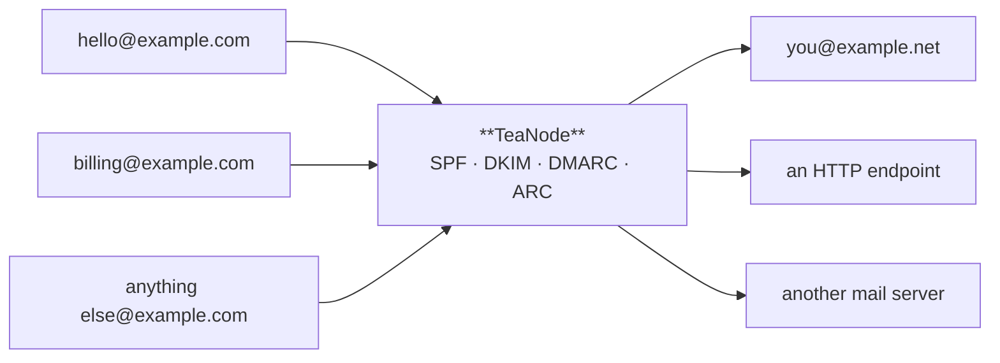
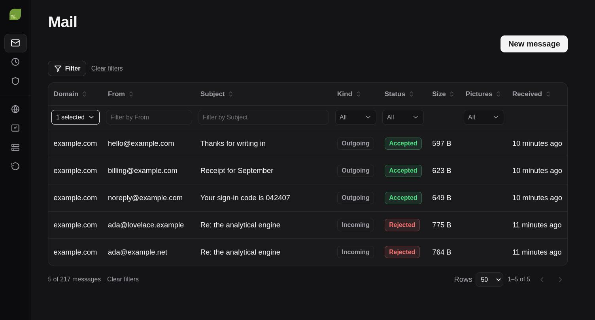
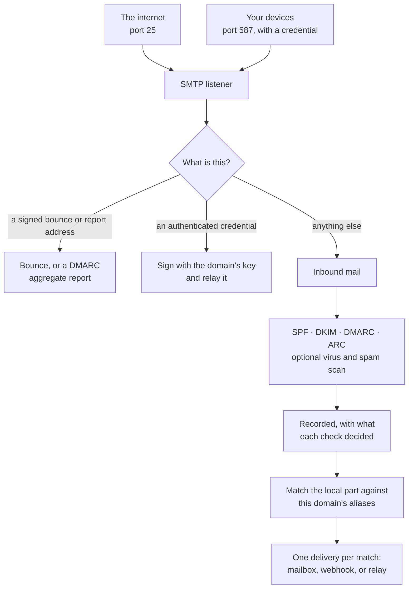

# TeaNode

A mail server for your own domains, in one binary.

It receives mail over SMTP, checks that it is genuine (SPF, DKIM, DMARC, ARC),
optionally scans it for viruses and spam, and forwards it wherever you say — to
your real mailbox, to a webhook, or to another mail server. It also relays
outbound mail from your own devices, signed with your domain's key so it
arrives rather than landing in spam.

It is deliberately **not** a mailbox server. There is no IMAP and no inbox.
Keep reading mail wherever you read it now; TeaNode owns the domain, the
authentication and the routing.

## Why

Running mail for a domain usually means either handing it to a provider, or
assembling Postfix, Dovecot, OpenDKIM, OpenDMARC, SpamAssassin and a policy
daemon and keeping them in agreement. This is one executable and a PostgreSQL
database, with the authentication that decides whether your mail is trusted
built in rather than bolted on.

## What it looks like

The dashboard is compiled into the binary; there is nothing else to deploy.

Every message this server has handled, what it decided about each one, and —
for mail sent from a template — whether the recipient's mail program fetched
the pictures in it. Clicking a row shows the authentication verdicts with the
evidence behind them, every delivery attempt and why any of them failed, and
the message itself with scripts stripped.

## Getting started

Download the binary, describe the server, run it:

    curl -L -o /usr/local/bin/teanode \
      https://github.com/ziyan/teanode/releases/latest/download/teanode-linux-amd64
    chmod +x /usr/local/bin/teanode

    mkdir -p /opt/teanode && cd /opt/teanode
    teanode config env --output .env \
      --hostname mail.example.com --domain example.com

Edit `.env` — it needs a PostgreSQL you can reach and an address for the
certificate authority to write to — then set the server up and start it:

    set -a; . ./.env; set +a
    teanode config init
    teanode dkim show example.com

That last command prints the DNS record for your signing key, which was
generated with the domain. Publish it, along with an MX record pointing at your
server, then:

    teanode run

The dashboard is on the same host. It lists exactly which DNS records are still
missing, so you can see what is left rather than guessing.

`docs/getting-started.md` has the full walk-through, including the DNS records
and the reality that many providers block outbound port 25.

## What you need

- A domain, and the ability to edit its DNS
- A host with a stable address, reachable on ports 25, 80, 443 and 587
- PostgreSQL, for the configuration and the mail it has handled

Nothing else. No AWS account, no Redis. Certificates are obtained
automatically over HTTP-01, so there is no DNS API to configure. An
S3-compatible object store is optional, and only worth having if you run more
than one instance: it is what lets them share the stored messages.

## What it does

**Authenticates everything.** SPF, DKIM, DMARC and ARC on the way in, with the
results shown per message. Your outbound mail is DKIM signed, and forwarded
mail keeps an ARC chain so it still passes at the far end.

**Forwards flexibly.** Aliases match the address with a regular expression and
send the message to an address, an HTTP endpoint, or another mail server. An
empty pattern is a catch-all, which receives whatever nothing else matched.

**Relays your outbound mail.** Per-device SMTP credentials on the submission
port, each optionally restricted to one sender address.

**Shows you the mail.** The dashboard renders a message as a message: the
authentication verdicts, the delivery attempts and why any of them failed, and
the body itself with scripts stripped and remote images blocked until you ask
for them.

**Sends mail you write.** Templates with variables and translations, a layout
around them, pictures served from your own domain, and a record of whether the
recipient's mail program fetched them.

**Reports on your domains.** Incoming DMARC aggregate reports are parsed and
kept, which is how you find out somebody is forging your domain.

**Optional extras, all off by default.** ClamAV, SpamAssassin, GeoIP, an S3
mirror of stored messages, an outbound SOCKS5 proxy for hosts whose address has
a poor reputation, and DNS-01 certificates if you need a wildcard.

## How a message gets through it

Every arrow above is a place the dashboard can show you what happened, which is
the point of recording it.

## Configuration

Configuration lives in the database, so several instances share one answer and
a change made in the dashboard reaches all of them. The environment says only
where that database is; everything else is stored.

    domains:
      - id: 01K2ZQ7B8MPJ3F9XV4T6WYNRC0
        domain: example.com
        subdomain: mail
        aliases:
          - id: 01K2ZQ7B8N6H4K2QDX8ZR5VTAE
            pattern: ^hello$
            kind: email
            email: you@example.net
          - id: 01K2ZQ7B8PA1M7CJW3YFB9SDQK
            pattern: ""            # catch-all
            kind: email
            email: everything@example.net

That is what `teanode config show` prints and what `teanode config import`
reads, so a whole server can be described in a file, put under version control
and loaded — but the running server's answer is the database. Every field is
documented in `docs/configuration.md`.

## Running it

`deploy/` has a systemd unit and a docker compose file. The container image
carries the dashboard and nothing else — no shell, no package manager.

## Contributing

`CONTRIBUTING.md` for conventions and the invariants that matter, `AGENTS.md`
for orientation, `docs/decisions/` for why the architecture is the way it is.

    make            # format, build, test
    make dev        # a development server on high ports that cannot send mail

## Security

Do not open a public issue for anything exploitable in mail handling,
authentication or certificate issuance. Report it privately through the
Security tab; `SECURITY.md` has the details and says what is in scope.

`docs/security/security-review.md` records a review of the whole program: what
was found, what was fixed, and what is still open.

## Licence

MIT. See `LICENSE`.
