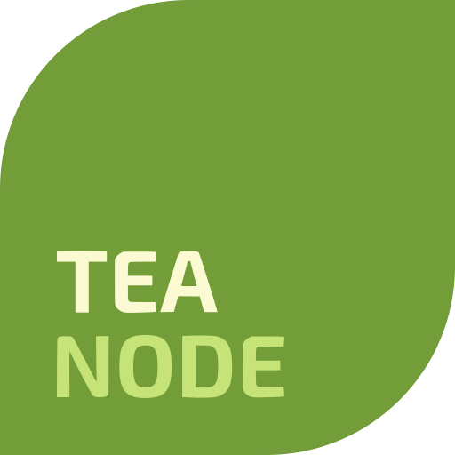
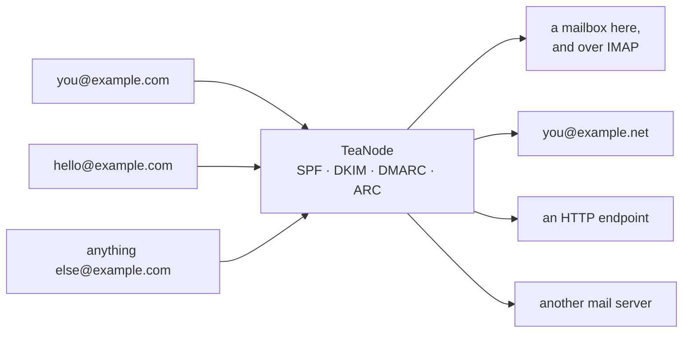
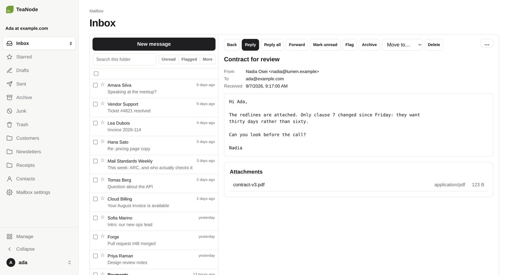
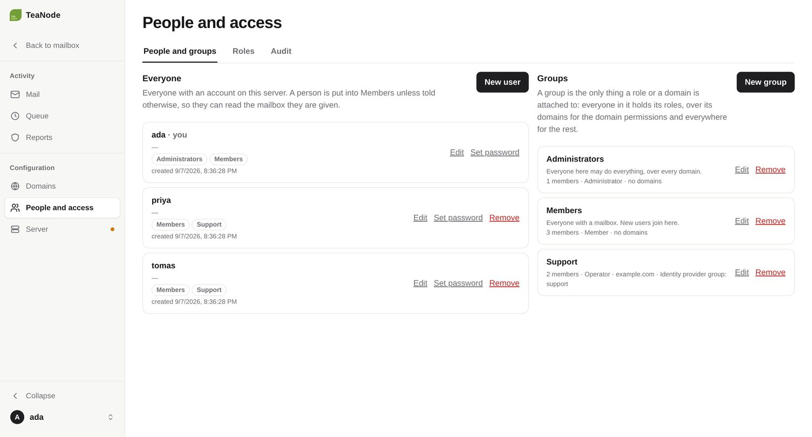
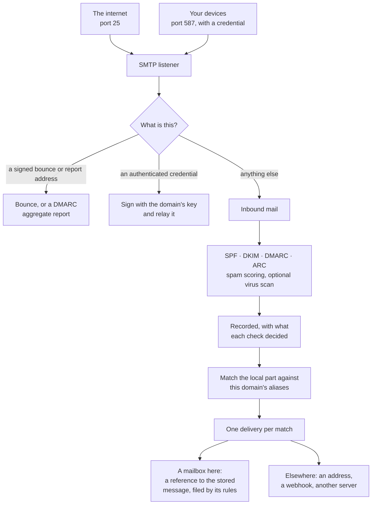

  

<h1 align="center">TeaNode</h1>

A mail server for your own domains, in one executable.

It receives mail over SMTP, checks that it is genuine (SPF, DKIM, DMARC, ARC),
scores it for spam and optionally scans it for viruses, and then either files
it in a mailbox here or hands it on — to an inbox you already read, to a
webhook, or to another mail server. It also relays outbound mail from your own
devices, signed with your domain's key so it arrives rather than landing in
spam.

A mailbox is read in the dashboard or in any mail program over IMAP. An address
that should not have a mailbox forwards instead, and one domain can do both.

## Why

Running mail for a domain usually means either handing it to a provider, or
assembling Postfix, Dovecot, OpenDKIM, OpenDMARC, SpamAssassin and a policy
daemon and keeping them in agreement. This is one executable and a PostgreSQL
database, with the authentication that decides whether your mail is trusted
built in rather than bolted on.

## What it looks like

The dashboard is compiled into the binary; there is nothing else to deploy. It
opens on your mailbox, and the pages that run the server are a mode behind
**Manage**, which shows only what your permissions allow.

Folders nest, search covers one folder or the whole mailbox, and a message is
shown the way a mail program would show it.

Behind **Manage** is the server: every message it has handled with what it
decided about each one, the queue, DMARC reports, the domains, and who may do
what.

A group is the only thing a role or a domain is attached to. Tie one to a
domain and its permissions reach that far and no further; give it the name of a
group in your identity provider and its membership follows the directory.

## Getting started

Download the two programs, describe the server, run it:

    curl -L -o /usr/local/bin/teanode-server \
      https://github.com/ziyan/teanode/releases/latest/download/teanode-server-linux-amd64
    curl -L -o /usr/local/bin/teanode \
      https://github.com/ziyan/teanode/releases/latest/download/teanode-linux-amd64
    chmod +x /usr/local/bin/teanode-server /usr/local/bin/teanode

    mkdir -p /opt/teanode && cd /opt/teanode
    teanode-server config env --output .env \
      --hostname mail.example.com --domain example.com

Edit `.env` — it needs a PostgreSQL you can reach and an address for the
certificate authority to write to — then set the server up and start it:

    set -a; . ./.env; set +a
    teanode-server config init
    teanode dkim show example.com

That last command prints the DNS record for your signing key, which was
generated with the domain. Publish it, along with an MX record pointing at your
server, then:

    teanode-server run

The dashboard is on the same host. It lists exactly which DNS records are still
missing, so you can see what is left rather than guessing. `teanode` is the
command line client for the same API: sign in from a laptop with
`teanode auth login --url https://mail.example.com`, and `teanode domain list`,
`teanode mailbox folder list`, `teanode group list` and the rest work from
there. A profile can be read-only, which is what to hand a script or an agent
that should look but not touch.

The first person to open the dashboard creates the account, which is an
administrator with a mailbox of its own. Point an address at that mailbox with
an alias of kind `mailbox`, make an app password under **Mailbox settings →
Mail programs**, and a mail program reads it over IMAP.

Or skip the binaries and run the compose file, which is how this is meant to
run in production: `docs/reference/deployment.md`.

`docs/getting-started.md` has the full walk-through, including the DNS records
and the reality that many providers block outbound port 25.

## What you need

- A domain, and the ability to edit its DNS
- A host with a stable address, reachable on ports 25, 80, 443 and 587, and on
  993 if mail programs are to read the mailboxes
- PostgreSQL, for the settings, the mailboxes and the mail it has handled

Nothing else. No AWS account. Certificates are obtained
automatically over HTTP-01, so there is no DNS API to configure. An
S3-compatible object store is optional, and only worth having if you run more
than one instance: it is what lets them share the stored messages.

## What it does

**Mailboxes.** Every account has one. Folders nest to any depth and can be
renamed, moved and pinned; search covers one folder or the whole mailbox, with
sender, recipient, subject, date and attachment filters; rules file mail as it
arrives, and can be run over mail already filed. There are drafts whose
attachments upload once, a signature, contacts kept from whoever you write to,
and an out-of-office reply that knows not to answer machines, mailing lists or
another mailbox that is also away. A message is stored once however many
folders hold it, and kept for as long as one of them does.

**IMAP.** Port 993, and STARTTLS on 143, so a mail program reads the same
mailbox. Each device gets an app password of its own, which signs in to IMAP
and sends through the submission port as any of the mailbox's addresses.

**Authenticates everything.** SPF, DKIM, DMARC and ARC on the way in, with the
results shown per message. Your outbound mail is DKIM signed, and forwarded
mail keeps an ARC chain so it still passes at the far end.

**Forwards flexibly.** Aliases match the address with a regular expression and
send the message to an address, an HTTP endpoint, or another mail server. An
empty pattern is a catch-all, which receives whatever nothing else matched.

**Relays your outbound mail.** Per-device SMTP credentials on the submission
port, each optionally restricted to one sender address.

**Shows you the mail.** The dashboard renders a message as a message: the
authentication verdicts, the delivery attempts and why any of them failed, and
the body itself with scripts stripped and remote images blocked until you ask
for them.

**Sends mail you write.** Templates with variables and translations, a layout
around them, pictures served from your own domain, and a record of whether the
recipient's mail program fetched them.

**Reports on your domains.** Incoming DMARC aggregate reports are parsed and
kept, which is how you find out somebody is forging your domain.

**People, groups and roles.** Permissions decide what each person sees:
Administrator, Operator and Member come seeded and all of it is editable, and a
group can be tied to a domain so its permissions reach only that far. Single
sign-on through an OpenID Connect provider follows a group in your own
directory. Every change to a user, group, role, domain, alias, credential or
mailbox is in the audit log.

**Scores spam without a second program.** The filter inside the server reads
what it already established about a message — the authentication results, the
sending host's confirmed reverse DNS name, the name it gave in HELO — consults
public block lists over ordinary DNS, and applies a classifier trained on the
mail you mark in the dashboard. An external SpamAssassin daemon is still
supported for deployments that want one.

**Optional extras, all off by default.** ClamAV, GeoIP, an S3 mirror of stored
messages, an outbound SOCKS5 proxy for hosts whose address has a poor
reputation, and DNS-01 certificates if you need a wildcard.

## How a message gets through it

Every arrow above is a place the dashboard can show you what happened, which is
the point of recording it.

## Configuration

Everything lives in the database, so several instances share one answer and a
change made in the dashboard reaches all of them. The environment says only how
to reach that database and which instance this process is.

Domains, aliases, credentials and accounts are rows, managed one at a time:

    teanode domain create example.com
    teanode alias create example.com --pattern '^you$' --kind mailbox --mailbox <mailbox id>
    teanode alias create example.com --pattern '^hello$' --kind email --email you@example.net

The settings — the listeners, TLS, the spam filter, single sign-on and the rest
— are one document, which `teanode-server config show` prints and
`teanode-server config import` reads, so a server's settings can be put under
version control and loaded. Every field is documented in
`docs/configuration.md`.

## Running it

`deploy/docker-compose.yml` is a complete deployment: the server, PostgreSQL,
and behind profiles the things only a cluster needs. It pulls the published
image, so there is nothing to build:

    docker compose up -d

The image carries the dashboard and nothing else — no shell, no package
manager. `docker compose build` still builds the checkout, which is what you
want when the change you are running is one you just made.

`docs/reference/deployment.md` walks the whole thing through, including
upgrades, what to back up, and running more than one instance.

## Contributing

`CONTRIBUTING.md` for conventions and the invariants that matter, `AGENTS.md`
for orientation, `docs/decisions/` for why the architecture is the way it is.

    make            # format, build, test
    make dev        # a development server on high ports that cannot send mail

## Security

Do not open a public issue for anything exploitable in mail handling,
authentication or certificate issuance. Report it privately through the
Security tab; `SECURITY.md` has the details and says what is in scope.

`docs/security/security-review.md` records a review of the whole program: what
was found, what was fixed, and what is still open.

## License

MIT. See `LICENSE`.
